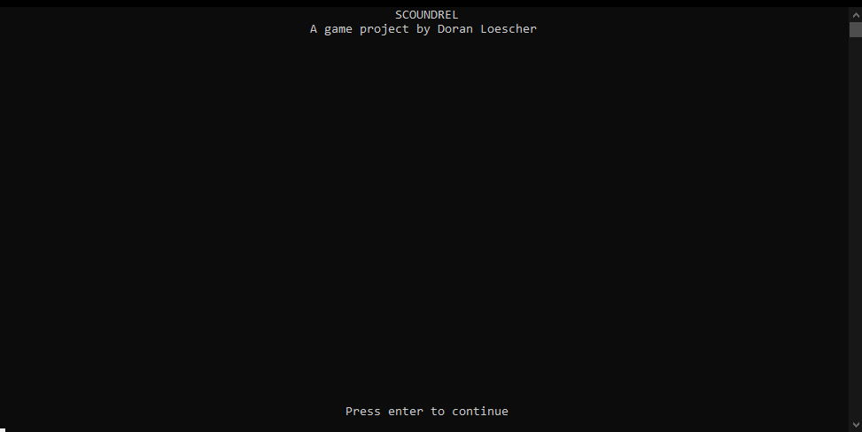
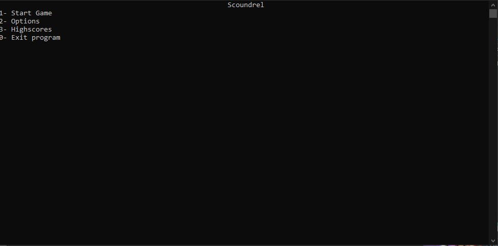
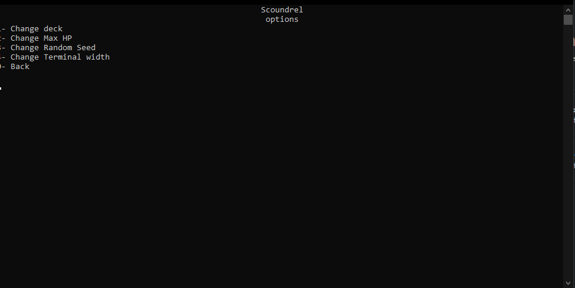
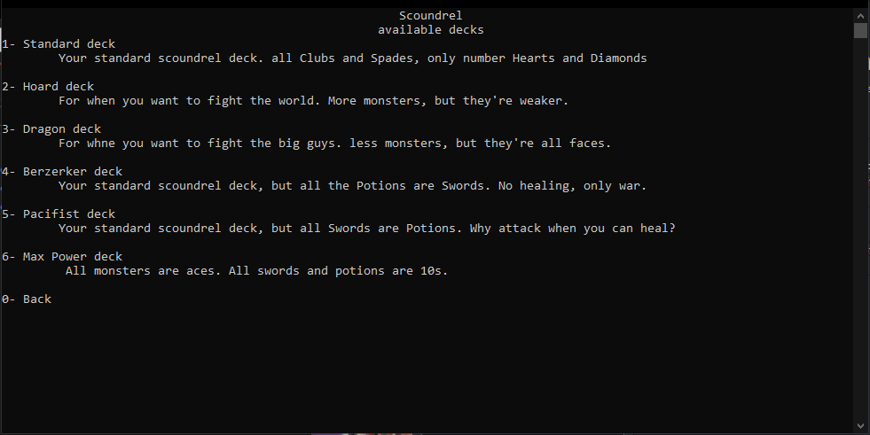
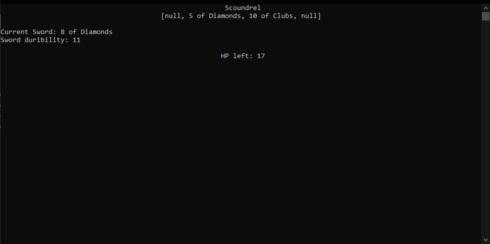
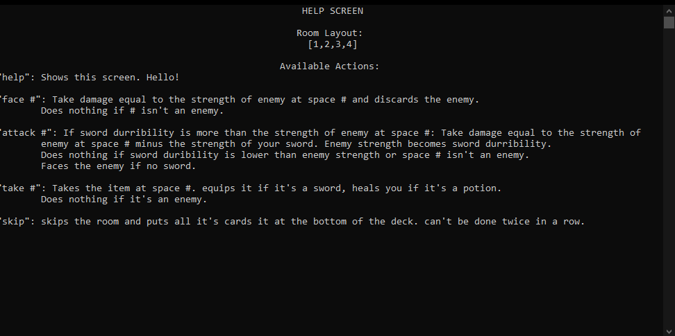
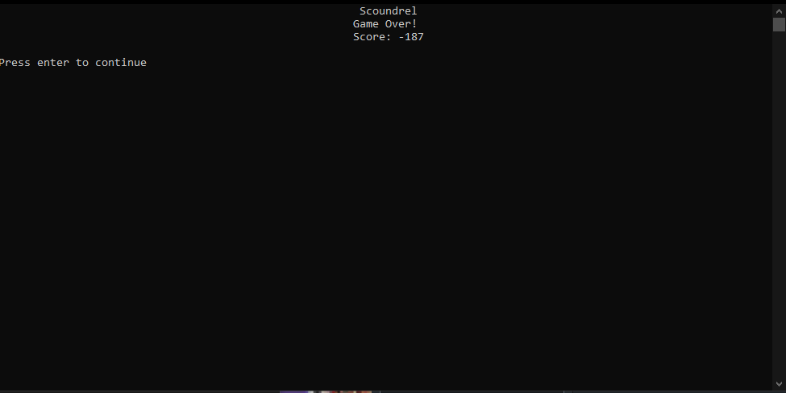

# Scoundrel-Card-Game-Class-Project
A Java based card game playable in the terminal that was initially created for a CS141 class I took.

# Contents
This repository contains:
 - Scoundrelproject.java: this is almost all of the game code, all in one giant class file.
 - Card.java: This is an object meant to represent a playing card.
 - Highscore.txt: this is a text file containing all of the highscores. 
 - Media: a file containing screenshots of the project for this readme.

# Dependancy and Installation
Download ScoundrelProject.java, Card.java, and Highscore.txt, keeping the three of them in the same file as one another. 
Make sure ScoundrelProject and Card are compiled. You can do this manually in the terminal or in an IDE like Geany.

# How to execute the project
To execute the project run ScoundrelProject.class. You can do this manually in the terminal or in an IDE like Geany.

# Project Sceenshots

# Credits
Mostly my own work.  
[One method taken from the terminal directory given to us for the class project, which itself has a link](https://docs.oracle.com/javase/8/docs/api/java/lang/System.html#getenv-java.lang.String-)  
[Looked up string methods to find lastIndexOf(). found it on this site](https://www.w3schools.com/java/java_ref_string.asp)

# To-do list:
There's some things I could change or include, namely javadoc.  
Outside of that, I am aware of one bug in the action processing that I could fix.

# Update and change log:
-U0-  
Uploaded the "finished" version of the game as what was turned in for the class.
